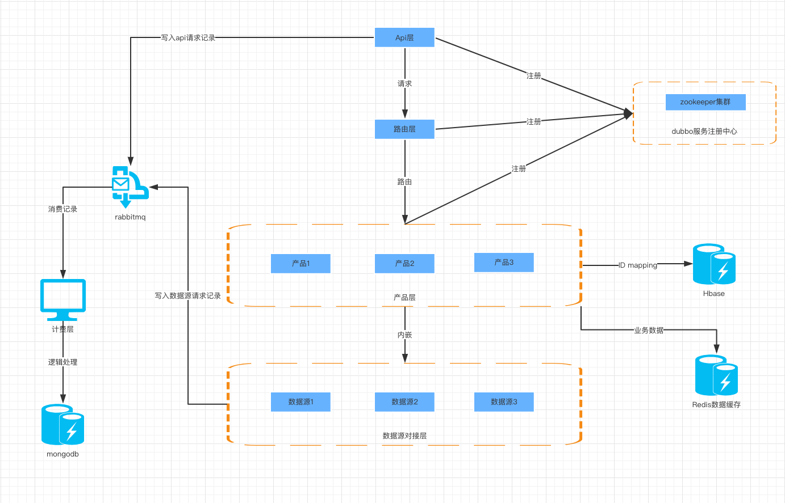

##  项目介绍

### zues

Api层，所有的数据请求都从该项目的DataController进入

### hades

路由层，将Api接受到的请求按照productId进行路由，进入相应的处理器

### helios

#### helios-common

Common层，没有具体的业务逻辑，主要是各个模块通用的类定义，如：常量、dto等

#### helios-data

##### helios-data-hbase

对hbase操作进行api封装，目前主要存储ID Mapping关系

##### helios-data-jpa

对jpa相关的定义，包含domain、repository、dto相关的定义，主要用来操作mysql的查询

##### helios-data-mongo

对mongo操作进行api封装

##### helios-data-rabbitmq

对rabbitmq操作进行api封装，主要存入数据源请求记录、api数据请求记录、缓存相关数据

##### helios-data-redis

对redis操作进行api封装

#### helios-proto

各层模块之间的原型定义

#### helios-util

工具类

### hydra

数据源结果封装成产品

### Hebe

数据源用户画像接口产品，主要包括金融类消费标签、电商消费行为评级标签、互联网行为自定画像产品。

### doris

百度开放平台Api数据源对接

### pan

运营商数据源对接

### ares

聚合数据源对接

### manto

用户画像数据源

### poseidon

rabbitmq缓冲数据消费者，主要消费rabbitmq数据源请求记录和Api请求记录存入mongo

## 系统架构图

- Api层：接受请求
- 路由层：路由到相应的产品处理器
- 产品层：将数据源请求结果包装成产品
- 数据源：对接各方数据源
- 计费层：计算Api请求的计费和数据源请求的成本并入库
- zookeeper：dubbo的注册中心
- Hbase：存储ID mapping数据
- Redis：存储缓存数据
- Rabbitmq：消费者和生产者解耦，提高系统吞吐和响应时间
- Mongodb：存储Api请求记录和数据源请求记录以及相关计费